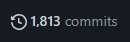

# Hack GitHub-Commit-Activity

The Hack GitHub Commit Activity project is a Python-based tool to help users manipulate their GitHub commit activity. It provides a unique way to customize the visual appearance of your contributions graph. Just to let you know, this tool is intended for experimental and learning purposes only. Misuse of this tool for unethical purposes is not condoned.

## Requirements

- Python 3.x installed on your system.

- Access to your GitHub account.

## Setup

Ensure Python is installed on your system. You can check if Python and pip (Python's package installer) are installed by typing the following commands in your terminal:

```
python --version
pip --version
```

## Built with

- Python

## Installation

Clone the repository to your local machine:

```
git clone https://github.com/EPW80/hack-github-activity.git
```

Navigate to the cloned directory:

```
cd hack-github-activity
```

## Usage

```
python git.py
```

## Image of GitHub commit activity post run



## Demo


## Contributor

Erik Williams

### Disclaimer

Just so you know, this tool is for educational and recreational purposes only. Any unethical use of this tool will not be the responsibility of the creator. Always respect GitHub's terms of service and use this tool responsibly.
